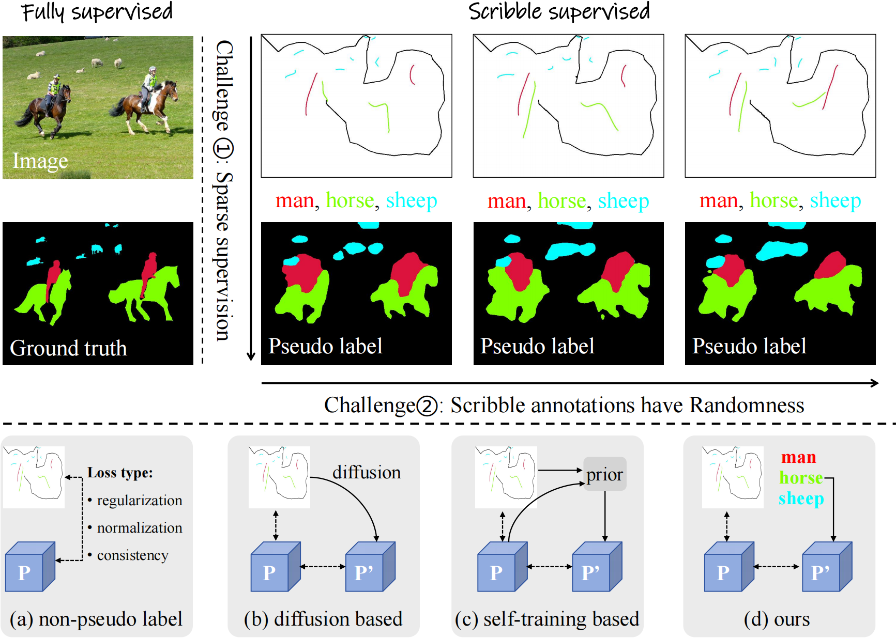

# Exploiting Inherent Class Label: Towards Robust Scribble Supervised Semantic Segmentation 

## Two main challenges in scribble-supervised semantic segmentation field

Scribble-supervised semantic segmentation presents two main challenges. While the issue of sparse supervision can be addressed by introducing pseudo-labels, the robustness challenge posed by the variability of scribble annotations remains to be investigated. In order to mitigate this issue, we proposed to generate the pseudo label via the inherent class label in scribble as presented in (d), which is different from previous methods (a)-(c). $P$ represents the model's prediction, $P'$ represents the pseudo label, the dotted line represents the supervision.
## Class-driven Scribble Promotion Network

In the first stage, taking ToCo as the basic network, we train the model with both image-level class supervision and the pixel-level scribble supervision. After training, we generate the pseudo-label from the classification branch, which will be used to train the semantic segmentation model in the second stage. In the second stage, we train the DeeplabV3+ with the basic supervision, distance perception module, and localization rectification module, adopting both scribble and the pseudo-label as the supervision.

### Dataset preparation

Follow [this page](https://github.com/Zxl19990529/ScribbleSimulation) to download the ScribbleCOCO, ScribbleCityscapes, ScribbleACDC, ScribbleSup datasets.

### Environment
Create the environment with anaconda3:``conda env create -f CSPNet.yaml``

- python>=3.9
- pytorch>=2.1.0
- timm==0.9.12
- opencv-python

### Evaluation
The current repository only contains the evaluation phase codes of CSPNet. The scripts are available at the ``scripts`` folder:

```sh
scripts/
├── ScribbleACDC
│   └── emlc_ACDC.sh
├── ScribbleCityscapes
│   ├── emlc_r101v3pLorm_scribbleToCoR1_dse2_dce7.sh
│   ├── emlc_r101v3pLorm_scribbleToCoR2_dse2_dce7.sh
│   └── emlc_r101v3pLorm_scribbleToCoR3_dse2_dce7.sh
├── ScribbleCOCO
│   ├── evalcoco_r101v3pLorm_ScribbleCutmix_R1_ds_e_dc_e7.sh
│   ├── evalcoco_r101v3pLorm_ScribbleCutmix_R2_ds_e_dc_e7.sh
│   ├── evalcoco_r101v3pLorm_ScribbleCutmix_R3_ds_e_dc_e7.sh
│   ├── evalcoco_r101v3pLorm_Scribblehas_R1_ds_e_dc_e7.sh
│   ├── evalcoco_r101v3pLorm_Scribblehas_R2_ds_e_dc_e7.sh
│   ├── evalcoco_r101v3pLorm_Scribblehas_R3_ds_e_dc_e7.sh
│   ├── evalcoco_r101v3pLorm_ScribbleReCAM_R1_ds_e_dc_e7.sh
│   ├── evalcoco_r101v3pLorm_ScribbleReCAM_R2_ds_e_dc_e7.sh
│   ├── evalcoco_r101v3pLorm_ScribbleReCAM_R3_ds_e_dc_e7.sh
│   ├── evalcoco_r101v3pLorm_ScribbleToCo_R1_ds_e_dc_e7.sh (ToCo_R1 denotes the pseudo labels are generated from the original ToCo)
│   ├── evalcoco_r101v3pLorm_ScribbleToCoR1_ds_e_dc_e7.sh (ToCoR1 denotes the pseudo labels are generated from our scribble-promoted ToCo)
│   ├── evalcoco_r101v3pLorm_ScribbleToCo_R2_ds_e_dc_e7.sh
│   ├── evalcoco_r101v3pLorm_ScribbleToCoR2_ds_e_dc_e7.sh 
│   ├── evalcoco_r101v3pLorm_ScribbleToCo_R3_ds_e_dc_e7.sh
│   └── evalcoco_r101v3pLorm_ScribbleToCoR3_ds_e_dc_e7.sh
└── ScribbleScribbleSup
    └── emlc_ToCo.sh
```
The checkpoints are available at [BaiduNetdisk](https://pan.baidu.com/s/1iE5thVH_z_Xm7q_h7Bar6Q?pwd=ayri)